<style type="text/css">
  th, td {
    align: center;
    vertical-align: middle;
    padding: 5px;
  }
</style>

<div style="text-align: center; padding: 350px 0">
<!-- Simulate H1 and H2 to avoid being inserted into TOC -->
<p style="font-size: 2.25em; font-weight: bold">Basic fpWeb Tutorial</p>
<p style="font-size: 1.75em; font-weight: bold">Mario Ray Mahardhika</p>
</div>

<div style="page-break-after: always;"></div>

# License

This tutorial is licensed under CC BY-SA, you should find a copy of the license as a file named LICENSE. If not, please find one in [Creative Commons website](https://creativecommons.org/licenses/by-sa/4.0/).

# Table of Contents

[TOC]

# Introduction

fpWeb is a web application framework shipped by FPC in its default distribution
as a part of fcl-web package. The framework itself is built on top of fcl-web
features. The framework is built with RAD mind to make a good use of
componentization in producing dynamic content. A Lazarus package is provided
that can use the framework in a drag n drop manner for its session management
and content production.

This tutorial will attempt to cover basic functionality of fpWeb, so that one
can build common web application with it. Note that this tutorial does **NOT**
attempt to teach HTTP protocol, HTML, CSS, JavaScript or database manipulation
as the protocol and client languages should be the prerequisites for every web
application programmer and database manipulation does not differ from desktop
implementation.

# Architecture (PLEASE read)

Before starting, it's necessary to know the architecture and application flow
to avoid confusion when certain things don't work or work unexpectedly. So
please spend some time reading this section.

## Application

Application here refers to the protocol that your app will implement. fpWeb will
happily switch from CGI, FCGI, Apache module to embedded server, and more if
fcl-web implements another one in the future. Each application is implemented in
its own unit, so to switch from one application to another, with the exception
of Apache module, one just needs to change the respective identifier in the uses
clause. Currently (as of 3.0.0 / 3.1.1), they are:

* fpCGI -> CGI
* fpFCGI -> FastCGI
* fpApache (requires httpd as well) -> Apache module
* fpHttpApp -> embedded server

Throughout this tutorial, we will use embedded server for the sake of simplicity
because you don't have to deal with setting up virtual server and messing up
with complicated configuration file and service management. Your app will be a
single binary portable web application! Another reason would be there are more
than just one web server application out there and each has different way to
configure. It would be overkill to cover all of them while their documentation
already does the job.

Apache module is implemented as a (dynamic) library, while other protocols are
normal application. Each application may have specific properties (such as port)
available and meaningful only to that application. That's why if you look at
fcl-web examples, .lpi / .lpr pairs for each protocol are put in their own
directories, only the web modules are shared.

## Web Modules

fpWeb applications consist of web modules which does the actual content
production. Web module can contain web actions that can divide the functionality
even more specific. For instance, an auth web module might have login and logout
web actions. While an about web module might not need an action at all and
serves just one content. Web module is integrated with fpTemplate that can be
used for producing dynamic content from a template file. This is roughly similar
to what PHP does, only the gap between logic and presentation is forced rather
than suggested. Some say that fpTemplate implements passive view while PHP by
default implements active view design pattern.

# Installation

fpWeb package for Lazarus is not installed by default (but it's shipped). So
light up your Lazarus and choose `Package->Install/Uninstall Package`, in the
`Available for installation` listbox, look for `weblaz` and press `Install
selection`. Press `Save and rebuild IDE` and confirm with `Continue`. Let the
IDE rebuild and restart itself. If everything goes well, you should now have
fpWeb tab in the component palette.

<center>
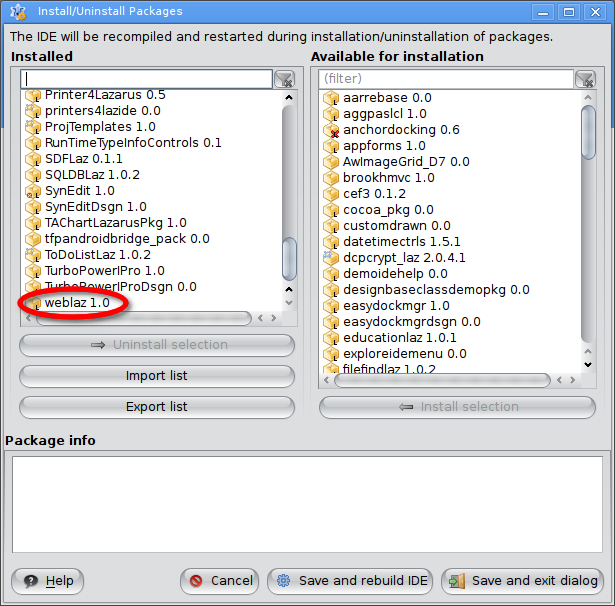
<p>Installed weblaz package</p>
</center>

# Hello, World!

As commonly taught when learning programming, "Hello, World!" will be our first
app. Open up Lazarus and choose `Project->New Project` then pick "HTTP server
Application".

<center>
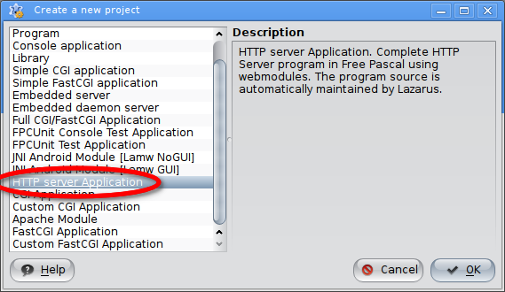
<p>Create new HTTP server application</p>
</center>

Another dialog shall appear for serving static files, port selection and
multithreading. You may skip the static files serving (go to tips and tricks
section if you want to know it more) and optionally modify the other options but
it won't matter much in this tutorial.

<center>
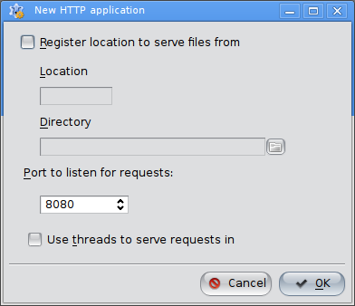
<p>Static files, port selection and multithreading options</p>
</center>

**IMPORTANT!**:

If you choose to use threads on *nix, don't forget to add `cthreads` as the
first unit in the .lpr's uses clause, otherwise a RTE 232 will be generated.
When running from console, a message:

> "This binary has no thread support compiled in.
> Recompile the application with a thread-driver in the program uses clause
> before other units using thread."

shall appear.

Since Jan 14, 2017 (or FPC 3.0.4), you may need to open the .lpr and add the
following line in the main body if it's not already there:

`Application.LegacyRouting := true;`

reason will be explained in chapter [Routing](#Routing).

Whatever you choose, pick "OK" and you'll be presented in the default one module
fpWeb app. Focus the module and move to object inspector. Feel free to rename
the module if you wish. Choose Events tab and click the button at the right of
the second column of the OnRequest row to create the event handler.

<center>
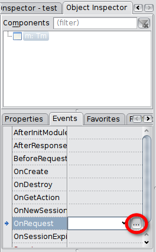
<p>Creating web module's OnRequest handler in the object inspector</p>
</center>

You will be redirected to the source editor with the following code:

```pascal
procedure TFPWebModule1.DataModuleRequest(Sender: TObject; ARequest: TRequest;
  AResponse: TResponse; var Handled: Boolean);
begin
  |
end;
```

Fill in the event with:

```pascal
procedure TFPWebModule1.DataModuleRequest(Sender: TObject; ARequest: TRequest;
  AResponse: TResponse; var Handled: Boolean);
begin
  AResponse.Content := 'Hello, World!';
  Handled := true;
end;
```

Then run your app. Remember the port you select previously or simply open the
.lpr to see it. Open your browser and type:

`http://localhost:<your selected port>/`

You should see "Hello, World!" displayed. If it doesn't, check below:

The framework does a lot of exception handling and the IDE's debugger
might catch them and interrupts your app. It's OK to add most of the exceptions
to the ignore list so you can concentrate more on your app flow. Keep skipping
and continue until no more dialog appears and the browser shows the output.

`Handled := true` is the way we tell the framework that the request has been
handled. Not setting it (or setting it to *false*) will show error page instead.
For now, this doesn't affect the request flow yet, but it will be later on. So
keep it that way until the time comes to further make a good use of it.

# Reading GET & POST data

A dynamic content is likely to be triggered from user input, either through
forms, providing values in the URL, etc. Those data are sent along the request,
which is represented in the method as `ARequest` parameter of type `TRequest`.

## Reading GET

GET data is provided as `ARequest.QueryFields`, which is a `TStrings`
descendant. In short, whatever you usually do with TStrings, is applicable here
such as accessing the data in a map style through the `Values` property.

Reusing above code, replace the method body with:

```pascal
procedure TFPWebModule1.DataModuleRequest(Sender: TObject; ARequest: TRequest;
  AResponse: TResponse; var Handled: Boolean);
var
  LName: String;
begin
  LName := ARequest.QueryFields.Values['Name'];
  if LName = EmptyStr then
    with AResponse.Contents do begin
      Add('<form action="' + ARequest.URI + '" method="GET"');
      Add('<label for="name">Please tell me your name:</label>');
      Add('<input type="text" name="name" id="name" />');
      Add('<input type="submit" value="Send" />');
      Add('</form>');
    end
  else
    AResponse.Content := 'Hello, ' + LName + '!';
  Handled := true;
end;
```

`ARequest.URI` is just a convenience to refer to the current URI, so even when
you change your registered module or action name, this code stays the same.

Note that as in Pascal, referring to the data is done case insensitively.

Now you can try requesting /, which will display

> Please tell me your name

and /?name=&lt;write anything here, e.g.: Bob&gt;, which will display

> Hello, Bob!

## Reading POST

POST is actually doesn't differ much from GET, only differs in which property to
access. If GET is accessed through `ARequest.QueryFields`, POST is accessed
through `ARequest.ContentFields`. POST style of previous code is:

```pascal
procedure TFPWebModule1.DataModuleRequest(Sender: TObject; ARequest: TRequest;
  AResponse: TResponse; var Handled: Boolean);
var
  LName: String;
begin
  LName := ARequest.ContentFields.Values['Name'];
  if LName = EmptyStr then
    with AResponse.Contents do begin
      Add('<form action="' + ARequest.URI + '" method="POST"');
      Add('<label for="name">Please tell me your name:</label>');
      Add('<input type="text" name="name" id="name" />');
      Add('<input type="submit" value="Send" />');
      Add('</form>');
    end
  else
    AResponse.Content := 'Hello, ' + LName + '!';
  Handled := true;
end;
```

## Reading File Uploads

One exception is for reading `multipart/form-data` fields, i.e. files. That one
is available in `ARequest.Files` as a `TUploadedFiles` instance, which is a
`TCollection` descendant. The following is TUploadedFiles public interface which
you can use to access the files:

```pascal
TUploadedFiles = Class(TCollection)
...
public
  Function First : TUploadedFile;
  Function Last : TUploadedFile;
  Function IndexOfFile(AName : String) : Integer;
  Function FileByName(AName : String) : TUploadedFile;
  Function FindFile(AName : String) : TUploadedFile;
  Property Files[Index : Integer] : TUploadedFile read GetFile Write SetFile; default;
end;
```

Each `TUploadedFile` itself has several properties:

```pascal
TUploadedFile = Class(TCollectionItem)
...
Public
  Destructor Destroy; override;
  Property FieldName : String Read FFieldName Write FFieldName;
  Property FileName : String Read FFileName Write FFileName;
  Property Stream : TStream Read GetStream;
  Property Size : Int64 Read FSize Write FSize;
  Property ContentType : String Read FContentType Write FContentType;
  Property Disposition : String Read FDisposition Write FDisposition;
  Property LocalFileName : String Read FLocalFileName Write FLocalFileName;
  Property Description : String Read FDescription Write FDescription;
end;
```

They should be descriptive enough, with the exception of `FileName` and
`LocalFileName`. `FileName` is the original file **name** as uploaded from
client, `LocalFileName` is the file **path** in the server where the file is
temporarily stored. Note the difference in bold terms above.

Again, reusing the same request handler:

```pascal
procedure TFPWebModule1.DataModuleRequest(Sender: TObject; ARequest: TRequest;
  AResponse: TResponse; var Handled: Boolean);
var
  n: Integer;
  f: TUploadedFile;
  i: Integer;
begin
  n := ARequest.Files.Count;
  if n = 0 then
    with AResponse.Contents do begin
      Add('<form id="form" action="' + ARequest.URI + '" method="POST" enctype="multipart/form-data">');
      Add('<label for="name">Drag n drop or click to add file:</label>');
      Add('<input type="file" name="input" />');
      Add('<input type="submit" value="Send" />');
      Add('</form>');
    end
  else begin
    f := ARequest.Files[0];
    AResponse.Contents.LoadFromStream(f.Stream);
  end;
  Handled := true;
end;
```

drag n drop a file (preferably text, as it's will be rendered as text) to the
input file field (or click the respective button) then click Send button. The
file content should be displayed.

# Cookies

## Setting

Cookies are browser responsibility to save and keep, therefore server need to
send it as part of the response in order to set one. `AResponse.Cookies`
contains a list of cookies to be sent. It's a descendant of `TCollection`,
respectively the contained `TCookie` is a descendant of `TCollectionItem`.
Therefore, you can use `TCollection` way of managing items to manipulate it.

Here's an example:

```pascal
procedure TFPWebModule1.DataModuleRequest(Sender: TObject; ARequest: TRequest;
  AResponse: TResponse; var Handled: Boolean);
var
  C: TCookie;
begin
  C := AResponse.Cookies.Add;
  C.Name := 'mycookie';
  C.Value := 'somevalue';
  Handled := true;
end;
```

You won't see any output in your browser. But if you use some kind of developer
tools (Chrome has one built-in), you can see the response header:

<center>
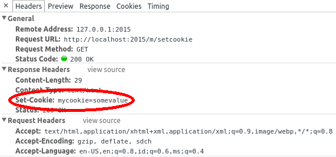
<p>Set-Cookie response header in Chrome's developer tools</p>
</center>

Note that cookie has attributes, so Name and Value is not the only two you can
set. Browse TCookie interface to see what properties are supported.

## Getting

Once you give `Set-Cookie` header above, subsequent request to your site will
contain additional header containing the value you ask to set previously:

<center>
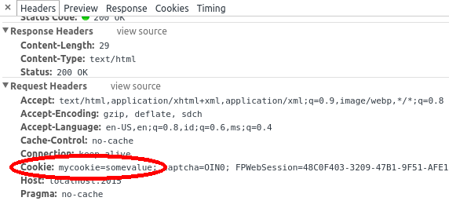
<p>Cookie request header in Chrome's developer tools</p>
</center>

Fortunately, the way to read it is no different from GET & POST data. The
related property is `ARequest.CookieFields`. To read previously set cookie:

```pascal
procedure TFPWebModule1.DataModuleRequest(Sender: TObject; ARequest: TRequest;
  AResponse: TResponse; var Handled: Boolean);
begin
  AResponse.Contents.Add('<p>Cookie get: ' + ARequest.CookieFields.Values['mycookie'] + '</p>');
  Handled := true;
end;
```

# Sessions

TFPWebModule is a descendant of TSessionHTTPModule, so it has session management
capability. Session is module based, so each module may choose to use or not to
use session management.

Session is implemented in abstract manner. By default, no implementation is
provided. One sample implementation using .ini files is given in `iniwebsession`
unit. You must have this unit in your project or implement one for session
management to work. If you decide to implement one, basically you need to extend
and implement abstract methods in `TCustomSession` and `TSessionFactory`
classes.

## Activating

To activate session management, set `CreateSession` property to true. Session
will be started prior to request handling. In case of a new session,
`OnNewSession` will be called. Initialize your session variables here.

## Session Variables Manipulation

Session variables are provided as `Session.Variables`. This is a string to
string map like structure, so you can read / write it like:

```pascal
Session.Variables['myvar'] := myvar; // write
...
myvar := Session.Variables['myvar']; // read
```

Setting a variable to empty string does **not** remove it. If you really want to
remove a variable, call `Session.RemoveVariable` instead.

## Terminating

Call `Session.Terminate` whenever you want to terminate a session (e.g.: user
logout). Session will also automatically expire if the next request comes after
`Session.TimeOutMinutes` since last request. When session terminates,
`OnSessionExpired` will be called. Do whatever cleanup you need there.

# Routing

Since FPC 3.0.4, a new routing mechanism has been implemented. Instead of
maintaining backward compatibility, it is decided that the new routing will be
the default. Thus, any old code (or new code depending on old routing) must
be ported by adding:

`Application.LegacyRouting := true;`

in the .lpr.

## Old Mechanism

### Using Multiple Modules

You can have multiple modules in your app. Click "File" menu, then click
"New...". A dialog shall appear, select "Web Module" from the treeview.

<center>
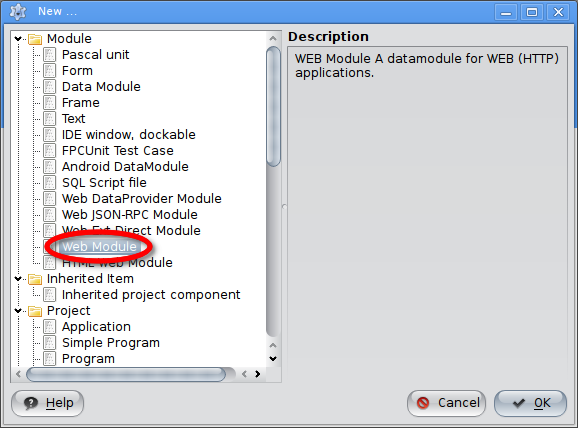
<p>Add new web module</p>
</center>

then click OK.

With multiple modules exist in your app, you can no longer request just with /.
The framework will not be able to magically select which module must serve the
response, so there are two ways to state which module you'd like to call:

1. /&lt;module name&gt;
2. /?module=&lt;module name&gt;

In the 2nd format, you can change "module" (which is the default value) to
whatever valid query string key by modifying `Application.ModuleVariable`.

### Using Actions

So far, we've only used web modules with single request handler. This doesn't
scale much as your web app gets more and more complex. Moreover, some features
might have shared properties and be better logically grouped, e.g.:

* Account module
    * Login action
    * Logout action
    * Register action

* Product module
    * Create action
    * Update action
    * Delete action
    * Details action

#### Request Handling Flow

Before using action, it is important to know fpWeb request handling flow.
Failing to do so might render your action useless because it's always your data
module that handles the request. How could that be? Going back a few chapters,
remember the `Handled := true` that we always did before? Now this is where
`Handled` parameter comes into play.

**Every** requests will go through module's OnRequest first, regardless the
requested action. Only if it does **not** set `Handled` to true, web action's
OnRequest is executed.

In general, the request flow is:

<center>

<p>fpWeb request flow</p>
</center>

Notice the "Our Concern" box, that's what we're going to put our attention at.

#### Add Actions to Web Modules

To add an action, select the web module then go to object inspector. In the
properties tab, select `Actions` and click the button on the second column.

<center>
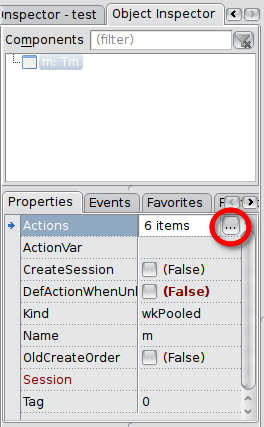
<p>Manage actions button in object inspector</p>
</center>

A popup window shall appear where you can add, delete and reorder actions.

<center>
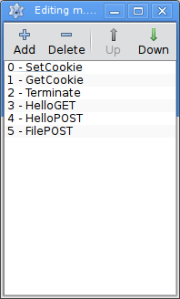
<p>Manage actions button in popup window</p>
</center>

Press Add, a new action shall appear in the list. Select it then go to object
inspector. It will currently show properties and events of that newly created
action. Rename the `Name` property (this will be the name you write in the URL,
so give it a short, simple but descriptive name) as you wish, I will choose
"Hello".  Move on to events tab, do the same as OnRequest for module, click
button on the right of OnRequest row to create the request handler.

<center>
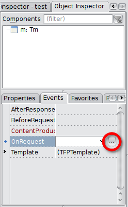
<p>Creating web action's OnRequest handler in the object inspector</p>
</center>

You will be presented in the same OnRequest interface, but this one handles web
action instead of web module. Whatever you can do in web module's OnRequest can
be done here as well. Copy the method body from the "Hello, World!" section.

Remember to remove `Handled := true` from the previous web module's OnRequest
body (or remove the event completely) for the action to take care of the request
handling.

Run your project, and fire up your browser. Now, since the request handling is
delegated to web action, you can no longer just request /, but you need
/&lt;action name&gt; or &lt;Module's ActionVar property&gt;=&lt;action name&gt;.
Note that &lt;Module's ActionVar property&gt; has a default value of empty
string, unlike `Application.ModuleVariable` which has "module" as the default
value. So, by default, you can only use the /&lt;action name&gt; form.

If you have multiple modules, then you have a variety of options:

1. /&lt;module name&gt;/&lt;action name&gt;
2. /&lt;module name&gt;?action=&lt;action name&gt;
3. /&lt;action name&gt;?module=&lt;module name&gt;
4. /?module=&lt;module name&gt;&action=&lt;action name&gt;

Note that as soon as a module have at least one action, /&lt;module or action
name&gt; alone will by default map to /&lt;action name&gt;. To change the
behavior such that it maps to /&lt;module name&gt; by default, set
`Application.PreferModuleName` to `true`. In case of multiple modules, if no
module name given, then the default module will handle the given action. To
change the behavior such that module name must be explicitly given, set
`Application.AllowDefaultModule` to `false`.

The following tables summarize what will happen based on the two properties:
<br />
<table border="1">
  <tr>
    <th colspan="2" rowspan="2">/&lt;module or action name&gt;</th>
    <th colspan="2">Application.PreferModuleName</th>
  </tr>
  <tr>
    <td>true</td>
    <td>false</td>
  </tr>
  <tr>
    <th rowspan="2">Application.AllowDefaultModule</th>
    <td>true</td>
    <td>/&lt;module name&gt;</td>
    <td>/&lt;default module&gt;/&lt;action name&gt;</td>
  </tr>
  <tr>
    <td>false</td>
    <td>/&lt;module name&gt;</td>
    <td>ERROR</td>
  </tr>
</table>

#### Default Action

Remember the previous diagram, the "Delegate request handling to actions" is
actually not so simple, but if we expand that diagram, the image will be too big
to fit. So, here's the diagram of that part:

<center>
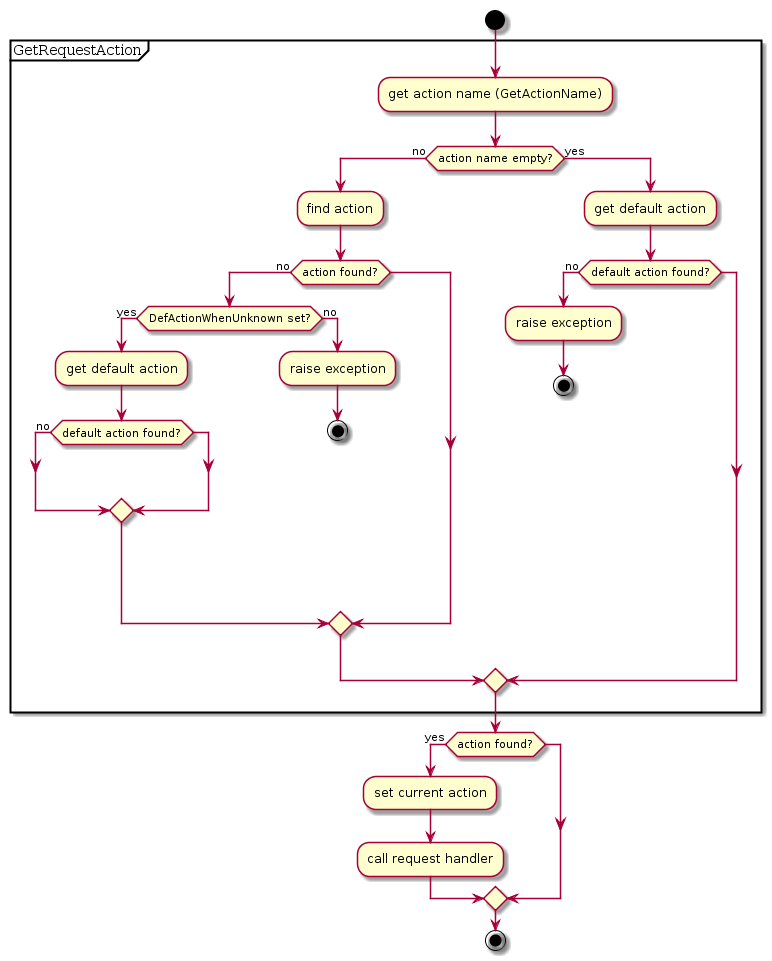
<p>Request delegation to action flow</p>
</center>

Two important things from the flow: `DefActionWhenUnknown` and a default action.
The former is a web module's property while the latter corresponds to `Default`
property of an action. In the latter case, in case there are more than two
actions having `Default` property set to true, the the action order (as how it's
shown in the manage actions popup window) will be considered to decide which is
the default action. The two properties forms what the application should do if
no matching action found for a given request.

The following tables summarize what will happen based on the two properties:
<br />
<table border="1">
  <tr>
    <th colspan="2" rowspan="2" align="center" valign="center">Request with<br />invalid action name</th>
    <th colspan="2" align="center" valign="center">DefActionWhenUnknown</th>
  </tr>
  <tr>
    <td>true</td>
    <td>false</td>
  </tr>
  <tr>
    <th rowspan="2" align="center" valign="center">Action.Default</th>
    <td>true</td>
    <td>Request handled by<br />default action</td>
    <td>Error: No action found for<br />action: &lt;action name&gt;</td>
  </tr>
  <tr>
    <td>false</td>
    <td>Error: Invalid action name<br />and no default action</td>
    <td>Error: No action found for<br />action: &lt;action name&gt;</td>
  </tr>
</table>
<br />
<table border="1">
  <tr>
    <th colspan="2" rowspan="2" align="center" valign="center">Request without<br />action name, i.e.: /</th>
    <th colspan="2" align="center" valign="center">DefActionWhenUnknown</th>
  </tr>
  <tr>
    <td>true</td>
    <td>false</td>
  </tr>
  <tr>
    <th rowspan="2" align="center" valign="center">Action.Default</th>
    <td>true</td>
    <td>Request handled by<br />default action</td>
    <td>Request handled by<br />default action</td>
  </tr>
  <tr>
    <td>false</td>
    <td>Error: No action name and no default action</td>
    <td>Error: No action name and no default action</td>
  </tr>
</table>

In case of error response above, a stack trace shall follow, complete with line
number information if you build your app with -gl. We'll see later on how to
create custom handler for this (stacktrace are no good for production). But for
now, make sure you understand the concept of web module and web action,
especially the request flow. Play around until you think you're ready for next
section.

## New Mechanism

The new mechanism is extremely flexible and works even without data modules
(old mechanism only works with data modules).

A dedicated unit for this routing is provided as `httproute` (add this to uses clause
of program / unit where you want to register routes). The unit contains a function
`HTTPRouter` that will return singleton object responsible for application's route
management and has `RegisterRoute` method to register your route.

### Route Syntax

The first parameter of `HTTPRouter.RegisterRoute` is the route that will be matched
against incoming request. It can be as simple as `*` above, which means 0 or more paths
or simply any paths, up to as complex as `/api/v1/:resource/*` which means `REQUEST_URI`
header should start with `/api/v1/` followed by something else that will be bound to
variable named `resource` and finally ended with 0 or more paths. It will match:

* `/api/v1/products`
* `/api/v1/products/1`
* `/api/v1/products/1/clone`
* `/api/v1/products/something/else/that/is/really/long/and/silly`

but not:

* `/api/v1`
* `/excuse/me/api/v1/products`

Basically there are only 3 special characters:

* `*` denoting 0 or more paths
* `:param` denoting a part
* `/` denoting part separator

your route will be composed of these 3 characters, plus everything else that made up a route. 

### Registering a Route

The 2nd, 3rd or 4th parameter (depending on whether you want to handle specific HTTP
method and/or pass additional data to it) of `HTTPRouter.RegisterRoute` is overloaded
with several possibilities:

- Callback procedure
  ```pascal
  TRouteCallback = Procedure(ARequest: TRequest; AResponse);
  ```

- Callback event
  ```pascal
  TRouteEvent = Procedure(ARequest: TRequest; AResponse) of object;
  ```

- Object satisfying a (CORBA) interface

  ```pascal
  IRouteInterface = Interface ['{10115353-10BA-4B00-FDA5-80B69AC4CAD0}']
    Procedure HandleRequest(ARequest : TRequest; AResponse : TResponse);
  end;
  ```

- Object extending abstract router class

  ```pascal
  TRouteObject = Class(TObject,IRouteInterface)
  Public
    Procedure HandleRequest(ARequest : TRequest; AResponse : TResponse); virtual; abstract;
  end;

  TRouteObjectClass = Class of TRouteObject;
  ```


By default, if 2nd parameter is not a `TRouteMethod`, then all HTTP methods will match.
Use one of `rmUnknown,rmAll,rmGet,rmPost,rmPut,rmDelete,rmOptions,rmHead, rmTrace`
to match only a specific HTTP method.

Registration order matters. If there are two or more routes matching the current request,
the earlier registered one will handle it.

In this new mechanism, standalone Hello, World! program can be as simple as:

```pascal
uses
  fphttpapp, httpdefs, httproute;

procedure DoHello(ARequest:TRequest; AResponse : TResponse);
begin
   AResponse.Content:='<html><body><h1>Hello,World!</h1></body></html>'
end;

begin
   HTTPRouter.RegisterRoute('*',@DoHello);
   Application.Port := 9000;
   Application.Initialize;
   Application.Run;
end.

```

# Using Templates

fpWeb has integrated support for FPTemplate, Free Pascal's generic templating
engine. It doesn't have to be used from web application context, but with
integrated support things will be easier a bit. At least the memory management
can be ignored as the module will take care of it.

There are two levels where one can use templates at: action and module. The full
RAD support is incomplete, so you need to go down to hand coding at some points.

There are two modes of operation: non-parameterized and parameterized. The
active mode is controlled by `AllowTagParams` property, which should be obvious
enough what value refers to what mode.

Template string can be given from a file through `FileName` property or a direct
string through `Template` property. Template.Template, I know it sounds weird :)
If both are filled then `FileName` will take precedence.

The two properties: `StartDelimiter` and `EndDelimiter` define how the engine
should recognize a template tag. For instance, if you have:

* StartDelimiter = '{+'
* EndDelimiter   = '+}'

then a string '{+title+}' defines a template tag named 'title'. Note that spaces
are significant, so '{+ title +}' defines a template tag named ' title ' instead
of just 'title'.

Special for parameterized mode, additional three properties:
`ParamStartDelimiter`, `ParamEndDelimiter` and `ParamValueSeparator` defines how
the engine should recognize a template tag parameter. For instance, if you have:

* ParamStartDelimiter = '[-'
* ParamEndDelimiter   = '-]'
* ParamValueSeparator = '='

then a string '{+data [-p=v-] [-a=b-] +}' defines a template tag named 'data'
with parameter 'p' of value 'v' and parameter 'a' of value 'b'. This can be used
to pass template level parameter such as expected date format, header-row-footer
for customizable output presentation, name of file, etc. you decide.

As a consequence of different way of operation, the core event where the
template works is different, too. Non-parameterized will use `OnGetParam` while
the parameterized will use `OnReplaceTag`. The two has of course different
interface:

```pascal
Type
  // OnGetParam: for simple template tag support only (ex: {Name})
  TGetParamEvent = Procedure(
    Sender : TObject;
    Const ParamName : String;
    Out AValue : String
  ) Of Object;
  // OnReplaceTag: for tags with parameters support
  TReplaceTagEvent = Procedure(
    Sender : TObject;
    Const TagString : String;
    TagParams:TStringList;
    Out ReplaceText : String
  ) Of Object;
```

In `OnGetParam`, you check for `ParamName`, then assign `AValue` accordingly.
i.e., if you want tag 'title' to be replaced by 'My App', then fill in the
method with:

```pascal
// use Trim() if you want the spaces around tag to be insignificant
case Trim(ParamName) of
  'title': AValue := 'My App';
  else     AValue := 'UNKNOWN';
end;
```

In `OnReplaceTag`, you check for `TagString` and optionally `TagParams`, then
assign `ReplaceText` accordingly. i.e., if you want tag 'datetime' to be
replaced by current time with parameter 'datetimeformat' to specify how the date
and time should be formatted, then fill in the method like this:

```pascal
// use Trim() if you want the spaces around tag to be insignificant
case Trim(TagString) of
  'datetime': AValue := FormatDateTime(TagParams.Values['datetimeformat'],Now);
  else        AValue := 'UNKNOWN';
end;
```

## At Action Level

Create/select an action, then go to object inspector. You will see a
subcomponent property named `Template`. This template is a normal `TFPTemplate`
instance. Expand it and fill in the properties as explained above. Now go to
Events tab, again expand `Template`, you will see the two events. Fill the one
based on your value of `AllowTagParams` property.

NOTE:
If your Lazarus cannot autocomplete the event, try writing the name manually in
the edit box then click the ... button. This is a bug in present Lazarus which
may be fixed in the future.

At this level, template with a content is not automatically set as request
handler. It might change in the future, but let's deal with its current state.
Fill in `OnRequest` event of the action, then fill it with:

```pascal
with Actions.CurrentAction as TFPWebAction do begin
  AResponse.Content := Template.GetContent;
end;
Handled := true;
```

The cast is required since `CurrentAction` is of type `TCustomWebAction` instead
of `TFPWebAction`. Without it, we can't access the `Template` property.

## At Module Level

At module level, you currently have to do it by hand coding since no RAD support
is implemented. The linked property is `ModuleTemplate`. This is however not a
regular `TFPTemplate` instance, but special `TFPWebTemplate` class that's a
descendant of it.

The idea here is to have module provide a layout while the actions provide
content, with the ability to provide additional variables. It's therefore a good
idea to keep `AllowTagParams` as is and assign `OnGetParam` event **of the
module** only. Do NOT assign `OnGetParam` of `ModuleTemplate` as it will
**never** be called.

A template tag named 'content' will be replaced automatically by what content
produced by action, everything else is either replaced from internal template
variables or from `OnGetParam`.

## Using Separated Template

Despite the somewhat incomplete integration, nothing stops you from using
fpTemplate (or any other templating solutions) manually, outside from the
integrated support. This could even be better in some cases since it's modular.

# Tips and Tricks

## Returning Different HTTP Response Code

By default, fpWeb will return HTTP 200 OK to indicate successful request
handling. This surely is not always the case, as user input might not be as what
we expected. To do so, set `AResponse.Code` in your request handler to the code
you want to return.

## Redirect Request to Different URL

A common flow after a successful login is to redirect user to his account page.
This can be done by calling `AResponse.SendRedirect` in your request handler,
supplying the URL to redirect request to.

## Serving Static Files (Embedded Web Server)

Remember the dialog in the Hello, World! section after you select HTTP server
Application? If you tick "Register location to serve files from" you can fill
"Location" (the URI segment, must not contain any slashes) and "Directory"
(physical directory in your computer, must exist at runtime) and the wizard will
simply add:

```pascal
RegisterFileLocation('<Location>','<Directory>');
```

to the beginning of your .lpr. You can actually do this by hand anytime and also
register multiple times for different locations / directories. After this you
can request `/<Location>/<any filename under Directory>` and it will be served
automatically. Note that the mimetype of the file is determined by fpmimetypes.
Call `MimeTypes.LoadFromFile` with your mime.types file in order to give correct
mimetype based on its extension. Otherwise, the file will always be served as
`application/octet-stream` which means the browser will download it instead of
interpreting it (especially important for JavaScript and CSS files).

## Centralize Management of Configuration and Modules

By default, the program file (.lpr) is the one that contains protocol unit. This
limits the ability to use `Application` object from other contexts such as from
web modules. Fortunately, it's not difficult to refactor to have what we want.
We remove `RegisterHTTPModule` calls from web modules' units and left out the
.lpr to empty main block with single unit identifier in the uses clause, we name
it: brokers. The unit contains:

```pascal
unit Brokers;

{$mode objfpc}{$H+}

interface

{ $define cgi}
{ $define fcgi}
{$define httpapp}

uses
  CustWeb;

function GetApp: TCustomWebApplication; inline;

implementation

uses
  {$ifdef cgi}
  fpcgi
  {$endif}
  {$ifdef fcgi}
  fpfcgi
  {$endif}
  {$ifdef httpapp}
  fphttpapp
  {$endif}
  ,webmodule1
  ,webmodule2
  ;

function GetApp: TCustomWebApplication;
begin
  Result := Application;
end;

initialization
  RegisterHTTPModule('wm1', TWebModule1);
  RegisterHTTPModule('wm2', TWebModule2);
  {$ifndef cgi}
  Application.Port := 2015;
  {$endif}
  Application.Initialize;
  Application.Run;

end.
```

This way, we can control over web module registration and also provide an API
to get `Application` object (casted as `TCustomWebApplication`), while still
easily switch between protocol implementations, in a single place.

## Terminating Gracefully (FastCGI / Embedded Web Server)

Instead of Ctrl+C-ing your app, there is a way for your app to terminate
gracefully, doing whatever cleanup it needs, by calling `Application.Terminate`.
You might need to use previous trick to easily access the `Application` object.
A common implementation is to provide a specific password protected module /
action that calls the `Terminate` method. You may choose whatever way you want,
though.

## Custom Exception Handler

To override the default exception handler, which prints stacktrace whenever an
exception is raised (i.e.: on HTTP 404 or 500), and thus not good for
production, you must assign `Application.OnShowRequestException`. This is a
method so you will need to provide an object that implements the method and
assign it by using the object. i.e.: if you have `MyExceptionHandler` as an
object of `TMyExceptionHandler` which has `MyShowRequestException` method, you
can assign it by:

```pascal
Application.OnShowRequestException := @MyExceptionHandler.MyShowRequestException;
```

don't forget to `.Create` `MyExceptionHandler` BEFORE assigning above or you
will get an `EAccessViolation`!

## Pure Hand Coding (No Form Designer Required)

It's not a must to use Lazarus' form designer to write an fpWeb application. You
can use pure hand coding technique to write it. The secret lies in the 3rd
parameter of `RegisterHTTPModule`: `SkipStreaming`. When this parameter is set
to true, fpWeb will not search for .lfm resource. Therefore everything must be
manually handled: property settings, event handlers, action registration, etc.

Note that it's logical to do what's usually done through object inspector in an
overriden constructor. Inside it, call the inherited constructor supplying both
AOwner and CreateMode as parameters. After that you can set properties, assign
event handlers, etc. Example:

```pascal
type
  THelloWorldModule = class(TFPWebModule)
    constructor CreateNew(AOwner: TComponent; CreateMode: Integer); override;
    procedure Request(Sender: TObject; ARequest: TRequest;
      AResponse: TResponse; var Handled: Boolean);
  end;

constructor THelloWorldModule.CreateNew(AOwner: TComponent; CreateMode: Integer
  );
begin
  inherited CreateNew(AOwner,CreateMode);
  OnRequest := @Request;
end;

procedure THelloWorldModule.Request(Sender: TObject; ARequest: TRequest;
  AResponse: TResponse; var Handled: Boolean);
begin
  AResponse.Content := 'Hello, World!';
  Handled := true;
end;
```
